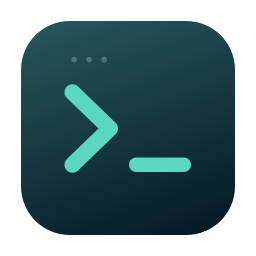

<p align="center"></p>
<h1 align="center">Harbor</h1>
<p align="center">A native macOS workspace for your remote machines.</p>
<p align="center"><a href="https://github.com/yangfeiyang-123/Harbor/releases/latest">Download</a> · <a href="docs/getting-started.md">Getting started</a> · <a href="docs/remote-display.md">Remote displays</a> · <a href="README.zh-CN.md">中文</a></p>

Harbor brings SSH terminals, remote files, a code editor, and simulation viewers
into one compact Mac app. Switch between a full terminal workspace and a file
workspace without losing your terminal arrangement.

## Download

**[Download Harbor for Apple silicon](https://github.com/yangfeiyang-123/Harbor/releases/latest)**

- macOS **14 or later**; the supplied binary is for **Apple silicon (M1 or newer)**.
- Unzip the release archive and drag **Harbor.app** into **Applications**.
- This initial community release is **ad-hoc signed, not Apple notarized**.
  If macOS blocks the first launch, use **System Settings → Privacy & Security →
  Open Anyway** after checking that you downloaded it from this repository.
  Do not disable Gatekeeper globally. See [Apple's instructions](https://support.apple.com/en-us/102445).
- Each release includes `SHA256SUMS.txt` for checking the downloaded archive.

Intel Macs do not have a prebuilt download in this release. The source build
route is available but has only been tested on Apple silicon.

## What you can do

- **Connect to your servers.** Import SSH aliases, use keys and `ProxyJump`,
  reorder servers, and keep several directory workspaces per server.
- **Arrange your terminals.** Split in either direction, drag tabs to reorder
  or group them, rename sessions, and switch terminal workspaces by keyboard.
- **Reconnect to your work.** A small remote Python PTY helper keeps supported
  sessions alive through a dropped SSH connection or closing Harbor, without
  requiring tmux. Terminal output and layouts are saved locally.
- **Work with files.** Browse, search, edit, preview Markdown, images, PDF and
  video, and use familiar multiselection and file operations.
- **Move files naturally.** Upload and download with progress, drag files
  between folders, or drag a fresh macOS screenshot directly into a remote
  directory. Drop files on a terminal to insert their paths.
- **Forward ports.** Create local, remote, or SOCKS5 forwarding rules through SSH.
- **View remote tools.** Open web viewers and noVNC through SSH tunnels, launch
  VNC clients, or configure the optional Isaac Sim WebRTC viewer.

The interface is in English, with light/dark themes, compact file icons, and
optional native glass styling on supported macOS versions. Harbor does not
include an AI chat service or a VS Code/Cursor extension host.

## Start a connection

1. Launch Harbor and choose **Import from SSH Config**, or add a server with **+**.
2. Select the server and open a terminal. Existing OpenSSH configuration and
   authentication are used; Harbor does not ship with any server accounts.
3. Choose a directory workspace using the folder selector, then use **Option+Z**
   to switch between terminals and Files & Code.

For remote files and persistent terminals, the remote machine needs **Python 3**.
Session survival depends on the remote helper and processes remaining alive;
it cannot survive a server reboot, account cleanup, or a killed process.
Closing a terminal explicitly ends that session. A disconnected connection
alone does not.

See [getting started](docs/getting-started.md) for authentication, shortcuts,
data storage, and common connection problems.

## Build from source

Use macOS with **Xcode 26 / Command Line Tools 26 or later** and Swift 6.2+.
The deployment target remains macOS 14. The native glass APIs require the newer
SDK at build time and fall back on older macOS at runtime.

```sh
git clone https://github.com/yangfeiyang-123/Harbor.git
cd Harbor
bash scripts/build-app.sh release
open .build/Harbor.app
```

SwiftTerm is vendored with its license and local compatibility patches.
The offline editor bundle and file icons are included, so **Node.js is not
needed for a normal app build**. To modify the editor, use Node.js 22+:

```sh
cd Editor
npm ci
npm run build
cd ..
```

Run the checks and create a release archive:

```sh
swift test --disable-sandbox --build-system native
python3 Tests/terminal_host_test.py
python3 scripts/test-workspace-runtime.py
bash scripts/package-release.sh
```

AppKit/WebKit tests need a logged-in macOS graphical session. Tests that require
a real remote server are opt-in and skipped by default. No contributor's
machines or credentials are needed for the default suite.

## Privacy and security

Harbor uses macOS OpenSSH. Private keys stay in the locations you configure and
passwords are handled by SSH, not bundled into server profiles. Workspace
settings and terminal recovery content are local; terminal scrollback can
contain sensitive command output, so protect your Mac account accordingly.

The remote PTY helper runs as your SSH user and uses a user-restricted Unix
socket. Remote files are accessed with that user's permissions. A local
simulation asset server is loopback-only and uses a random URL token.

Personal server profiles, VPN routes, private logs, and terminal histories are
not distributed. For reporting an issue, remove secrets from logs first. See
[SECURITY.md](SECURITY.md) and [known limits](docs/getting-started.md#known-limits).

## License

[MIT](LICENSE), Copyright © 2026 Feiyang Yang. Contributions are welcome; see
[CONTRIBUTING.md](CONTRIBUTING.md).

Third-party components retain their own licenses. The optional NVIDIA WebRTC
library is **not bundled in public releases**; users install it separately under
NVIDIA's terms. See [third-party notices](THIRD_PARTY_NOTICES.md).
